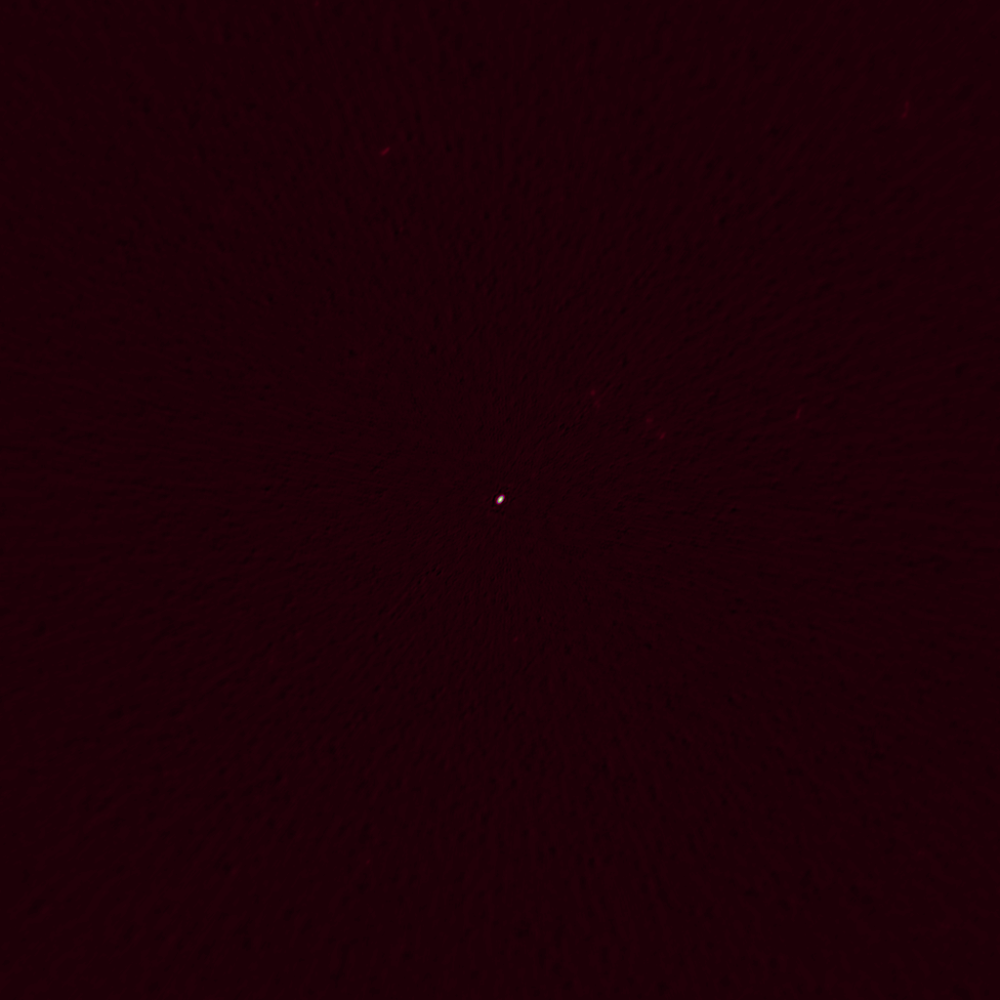
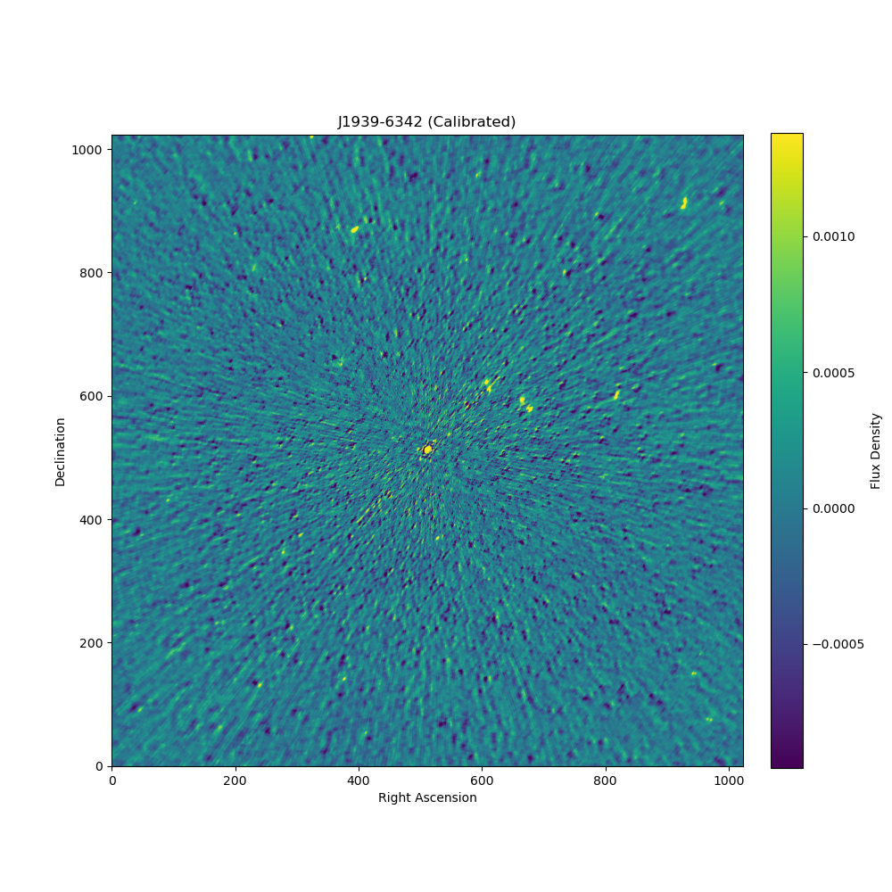

# 🛰️ Calibrating the Cosmos: An End-to-End MeerKAT Data Pipeline

This repository documents a complete, end-to-end pipeline for calibrating and imaging a 12.5 GB uncalibrated dataset from the MeerKAT radio telescope (UHF Band). The project transforms raw, noisy visibility data into a science-ready, high-fidelity image, demonstrating a professional workflow in radio astronomy and data science.

This project also serves as a case study for running complex astronomical software (CASA) on Apple Silicon hardware, detailing the specific workflow required. The final data products serve as a bridge between scientific data processing and creative applications in art and sound.

---

### Final Calibrated Image



---

## Key Features & Outcomes

*   **Full Calibration Cascade:** Implements a standard workflow including autocorrelation flagging, bandpass calibration, and gain calibration.
*   **Deconvolution Imaging:** Uses the `tclean` algorithm to produce a clean science image from the calibrated data.
*   **Data Validation:** Generates diagnostic plots from calibration tables to validate the pipeline's results.
*   **Reproducible Workflow:** The entire process is scripted for automation on Apple Silicon hardware.
*   **Art-Science Integration:** The final data products (FITS image, diagnostic plots) are used as raw material for visual art textures and data-driven sonification.

## The Workflow: From Raw Data to Clean Image

This project was executed on an Apple M1 Max Mac Studio. The workflow was developed to overcome the lack of native ARM64 support for modular CASA packages.

1.  **Environment Setup:** The pipeline uses the official **Intel build of CASA 6.x running under Apple's Rosetta 2** translation layer. This is the standard, stable method for this hardware.
2.  **Data Processing (`--pipeline` mode):** The main script, `calibrate_meerkat.py`, is run in CASA's pipeline mode to perform all heavy data processing:
    *   **Inspection (`listobs`):** The raw MeasurementSet is inspected.
    *   **Flagging (`flagdata`):** Autocorrelation data and known RFI bands at the edges are flagged.
    *   **Calibration (`bandpass`, `gaincal`):** Calibration tables are created to solve for instrumental errors.
    *   **Application (`applycal`):** These solutions are applied to the science data.
    *   **Imaging (`tclean`):** A clean image is produced via deconvolution.
    *   **Export (`exportfits`):** The final CASA image is exported to the universal FITS format.
3.  **Analysis & Visualization (Interactive Mode):**
    *   Diagnostic plots are generated by running `plot_bandpass.py` from within an **interactive CASA session** (`execfile`), as `plotcal` requires CASA's graphical toolkit.
    *   The final `.fits` file is inspected using **SAOImage DS9**.

## How to Replicate This Project

1.  **Prerequisites:**
    *   An Apple Silicon Mac running macOS.
    *   Apple Rosetta 2 installed (`softwareupdate --install-rosetta --agree-to-license`).

2.  **Software:**
    *   Download and install **CASA 6.x for macOS (Intel)** from the [NRAO website](https://casadocs.nrao.edu/getting-started/installation/).

3.  **Data:**
    *   Download the uncalibrated MeerKAT dataset (`1740033067-sdp-l0_...`). Place the `.ms` directory inside the `/data` folder.

4.  **Execution:**
    *   Update the `vis_file` path in `scripts/calibrate_meerkat.py`.
    *   Run the main pipeline from your terminal:
        ```bash
        /Applications/CASA.app/Contents/MacOS/casa --pipeline -c scripts/calibrate_meerkat.py
        ```
    *   To generate the bandpass plot, launch CASA interactively (`/Applications/CASA.app/Contents/MacOS/casa`) and run:
        ```python
        execfile('scripts/plot_bandpass.py')
        ```

## Acknowledgements and Data Policy

This project uses data from the MeerKAT telescope, managed by the South African Radio Astronomy Observatory (SARAO). The data is publicly available from the [SARAO Archive](https://archive.sarao.ac.za/).

In accordance with the SARAO data access policy, any publications or presentations resulting from the use of this data must include the following acknowledgement:

**"The MeerKAT telescope is operated by the South African Radio Astronomy Observatory, which is a facility of the National Research Foundation, an agency of the Department of Science and Innovation."**